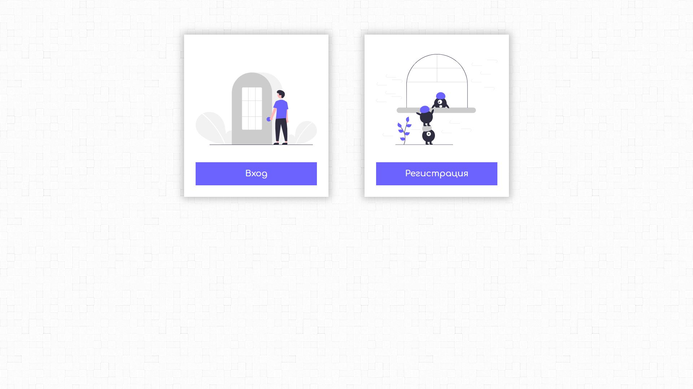
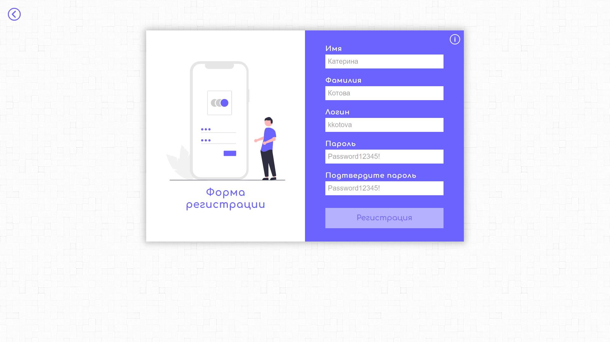
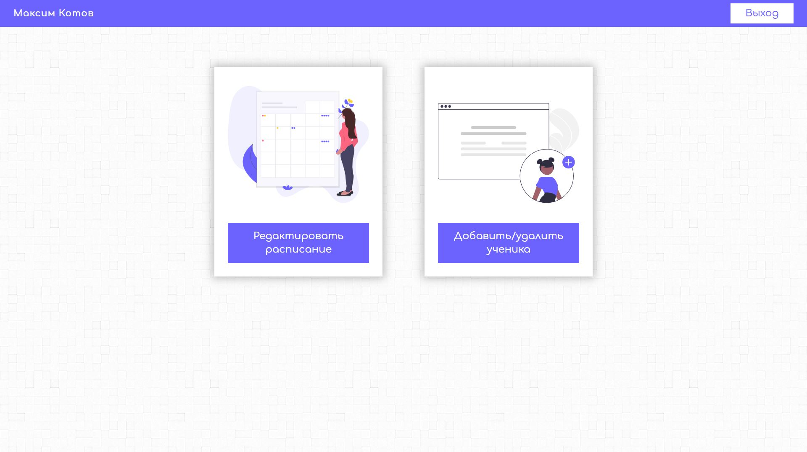
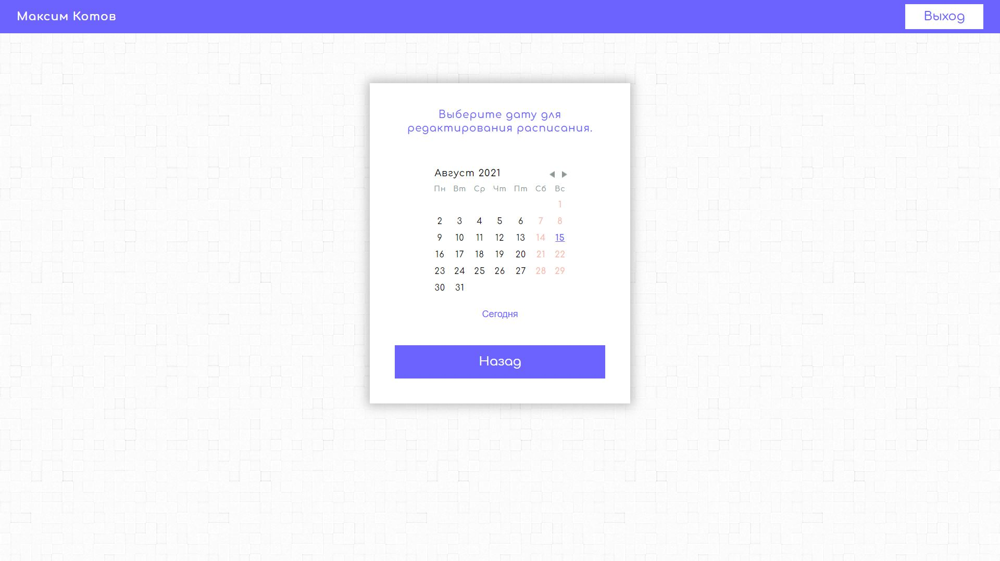
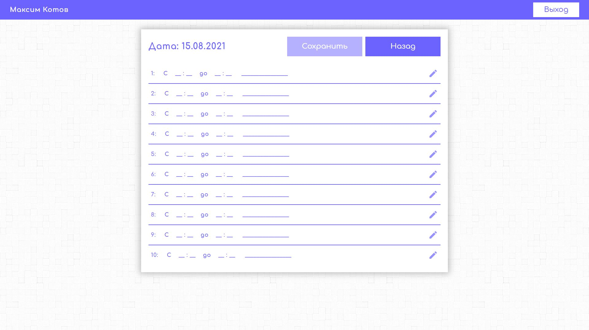
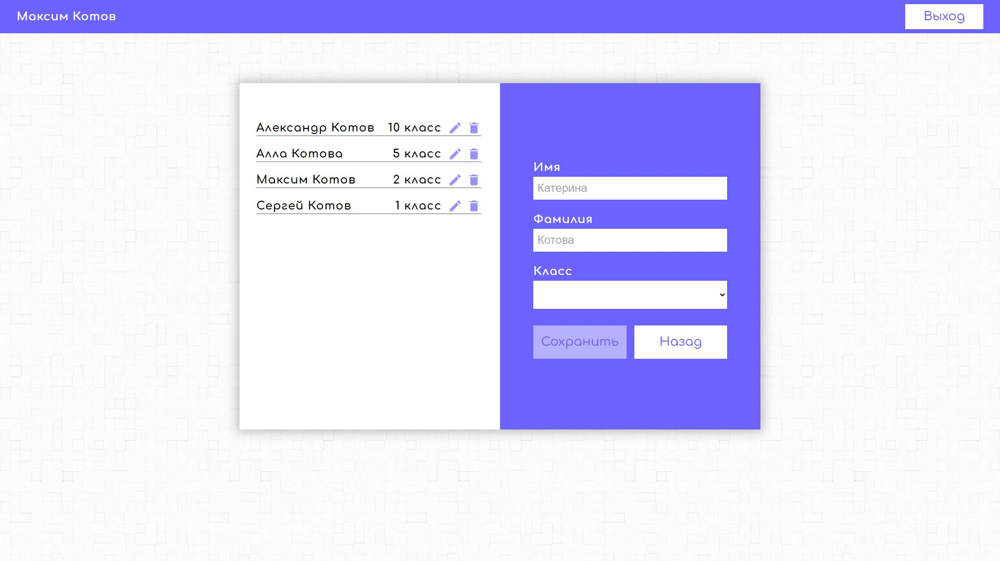

# Timetable and students editor.

**Start page.**

**Login form**

**Signin form**

**Account**

**Calendar**

**Timetable editor**

**Add student**

To install und run the project:

 ### `1. npm install`
 ### `2. npm start`

(Please check the back-end part: [https://github.com/VolodymyrVoronov/music-school-timetable-back](https://github.com/VolodymyrVoronov/music-school-timetable-back))

*DISCLAIMER:*
Please note, this project is for demonstration purpose only.